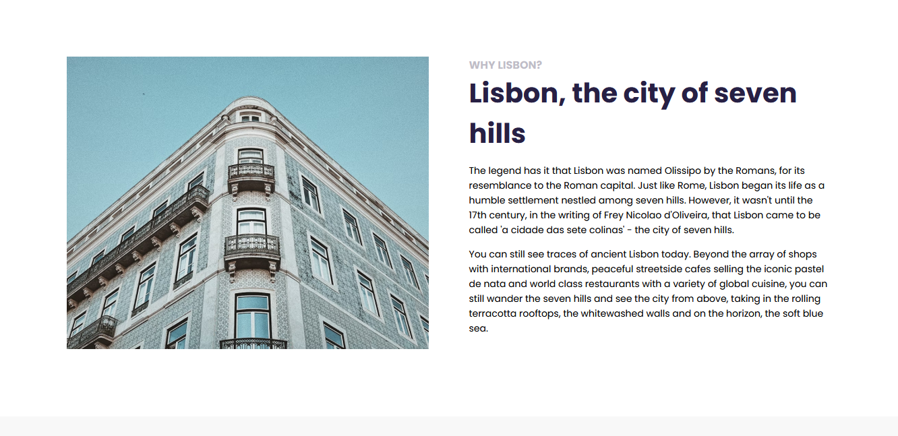
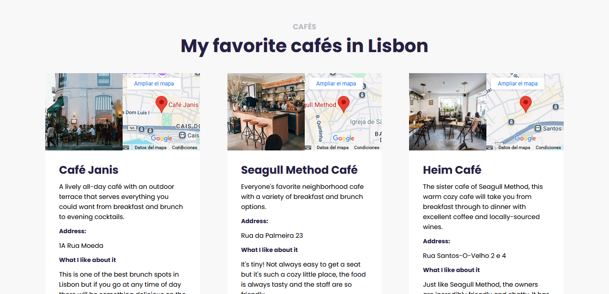
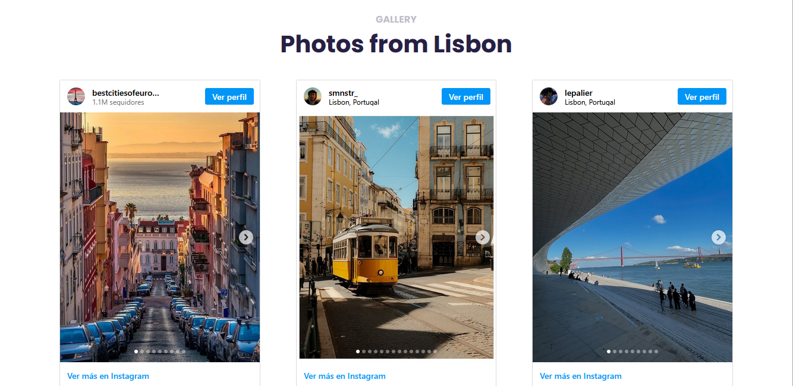

## 📍 Lisbon, Portugal
👉🏽 Responsive website dedicated to discovering Lisbon, the fascinating capital of Portugal. Explore recommendations for cozy cafés and ideal spots to relax during your visit. 
In addition, enjoy an interactive gallery with a carefully curated selection of city photographs 📷, sourced directly from Instagram, so you can experience the essence of Lisbon from different perspectives.

<strong>Key Features:</strong>  
📱 Adaptable design for mobile and desktop devices. 
✔ Guide to highlighted places for relaxation and enjoying local coffee. 
📷 Gallery section with inspiring images of Lisbon curated from Instagram. 
✨ Simple navigation and visually appealing experience. 

💡 The page was built with HTML, CSS and JavaScript. 
📌 The web is hosted on <a href="https://travelers-lisbon.netlify.app/">Netlify</a>

### Lisbon ✨ 

### Best cafés in Lisbon 🤩

### Photos from Lisbon 😍📷

